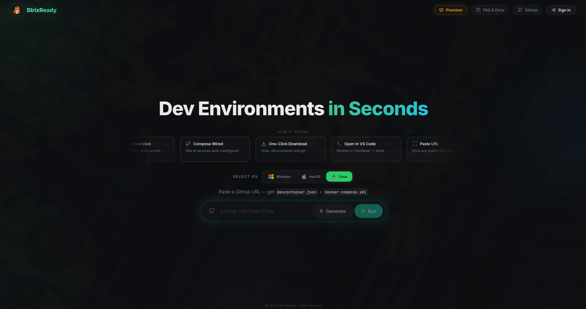

<div align="center">


<br/>

<!-- Live repo stats -->


<br/>

<!-- Tech stack -->
[](https://react.dev/)
[](https://typescriptlang.org/)
[](https://vitejs.dev/)
[](https://tailwindcss.com/)
[](https://ui.shadcn.com/)

<br/>

**[🚀 Quick Start](#-quick-start) · [⚙️ How It Works](#%EF%B8%8F-how-it-works) · [🖥️ CLI Companion](#%EF%B8%8F-cli-companion) · [💻 Tech Stack](#-tech-stack) · [🔮 Roadmap](#-roadmap)**

</div>

---

## 📖 Overview

**StrixReady** is an AI-powered developer toolchain that eliminates the friction of setting up local development environments.

The reality: cloning a repo and getting it to *actually run* often takes hours — writing Dockerfiles from scratch, hunting down missing env vars, wiring up databases, and wrestling with DevContainer configs. **StrixReady automates all of that.**

> 💡 Paste a GitHub URL. Pick your OS. Get a production-ready `devcontainer.json` & `docker-compose.yml` — fully configured, zero manual setup.

> **This repository is the Frontend GUI.** The generation engine lives in the [StrixReady CLI →](https://github.com/sanjayrohith/strix-cli)

---

## 🎬 Gallery

<div align="center">
  
</div>

> Replace the screenshot above with a GIF recording of the UI in action for maximum impact. Tools: [LICEcap](https://www.cockos.com/licecap/) (Win/Mac) · [Peek](https://github.com/phw/peek) (Linux)

---

## ⚙️ How It Works

```
  GitHub URL + OS Selection
         │
         ▼
  ┌─────────────┐    POST /generate    ┌──────────────────────────────┐
  │  StrixReady │ ──────────────────▶  │        Backend  :8000        │
  │   Frontend  │                      │                              │
  └─────────────┘                      │  1. Clone repository         │
                                       │  2. Scan package.json        │
                                       │     + lock files + CI config │
                                       │  3. Detect full stack        │
                                       │  4. Generate config files    │
                                       └──────────────┬───────────────┘
                                                      │
                                       ┌──────────────┴───────────────┐
                                       ▼                              ▼
                               devcontainer.json           docker-compose.yml
                                       └──────────────┬───────────────┘
                                                      │
                                          ✅ Open in VS Code
```

| # | Step | What happens |
|---|------|-------------|
| **01** | **Input** | Paste any public GitHub URL · Select host OS (Windows / macOS / Linux) |
| **02** | **Dispatch** | Frontend sends `POST {"url":"...","os":"..."}` to `localhost:8000` |
| **03** | **Analysis** | Backend clones repo · scans manifests, lock files, CI configs |
| **04** | **Generation** | Assembles `devcontainer.json` + `docker-compose.yml` with all services wired |
| **05** | **Ready** | Open in VS Code → DevContainer builds → start coding immediately |

---

## 🖥️ CLI Companion

> The same powerful generation engine — available directly in your terminal and scriptable for CI/CD pipelines.

<div align="center">

### 🔗 [StrixReady CLI →](https://github.com/sanjayrohith/strix-cli)


</div>

```bash
$ strixready generate --url https://github.com/user/my-app --os linux

  → Cloning repository...
  → Detected stack: Next.js · PostgreSQL · Redis
  → Generating devcontainer.json...
  → Generating docker-compose.yml...

  ✓ Environment ready in 4.2s
```

| Feature | Frontend GUI | CLI |
|---------|:---:|:---:|
| Interactive visual UI | ✅ | — |
| Terminal-native workflow | — | ✅ |
| CI/CD scriptable | — | ✅ |
| Config preview & editor | ✅ | Planned |
| Same generation engine | ✅ | ✅ |

---

## 💻 Tech Stack

| Layer | Technology | Purpose |
|-------|-----------|---------|
| Framework | [React 18](https://react.dev/) + [Vite](https://vitejs.dev/) | UI rendering & fast builds |
| Language | [TypeScript](https://www.typescriptlang.org/) | Type-safe development |
| Styling | [Tailwind CSS](https://tailwindcss.com/) | Utility-first styling |
| Components | [shadcn/ui](https://ui.shadcn.com/) + [Radix UI](https://www.radix-ui.com/) | Accessible, composable UI |
| Icons | [Lucide React](https://lucide.dev/) | Consistent icon set |
| Routing | React Router DOM | Client-side navigation |
| State & Fetching | React Query + Fetch API | Server state management |

---

## 🚀 Quick Start

### Prerequisites

- **Node.js** 18+
- **npm**
- **StrixReady Backend** running at `http://localhost:8000` → [CLI Repo ↗](https://github.com/sanjayrohith/strix-cli)

### Installation

```sh
# 1. Clone the repository
git clone https://github.com/sanjayrohith/StrixReady.git
cd StrixReady

# 2. Install dependencies
npm install

# 3. Start the dev server
npm run dev
# → http://localhost:8080 (or 8081 if occupied)
```

### Production Build

```sh
npm run build
npm run preview
```

---

## 📁 Project Structure

```
StrixReady/
├── public/
│   └── screenshot.png       ← UI preview image
├── src/
│   ├── components/          ← Reusable UI components (shadcn/ui)
│   ├── pages/               ← Route-level page components
│   ├── hooks/               ← Custom React hooks
│   ├── lib/                 ← Utility functions & helpers
│   └── main.tsx             ← Application entry point
├── index.html
├── tailwind.config.ts
├── tsconfig.json
└── vite.config.ts
```

---

## 🔮 Roadmap

- [ ] **Real-time Progress Streaming** — Replace the static spinner with live SSE/WebSocket log streaming from the backend during clone and analysis.
- [ ] **Interactive Config Editor** — Preview and tweak generated `devcontainer.json` and `docker-compose.yml` (ports, extensions, env vars) directly in the browser before downloading.
- [ ] **Environment History** — Persist recently generated environments locally for quick re-access and comparison.
- [ ] **Dark / Light Mode Toggle** — Accessible light mode alongside the current dark glassmorphism theme.
- [ ] **Direct "Open in VS Code"** — Deep linking via `vscode://` to auto-launch the editor and trigger the container build with zero manual file placement.
- [ ] **Monorepo Multi-service Detection** — Smarter analysis of monorepo structures with automatic service isolation in the generated compose file.

---

