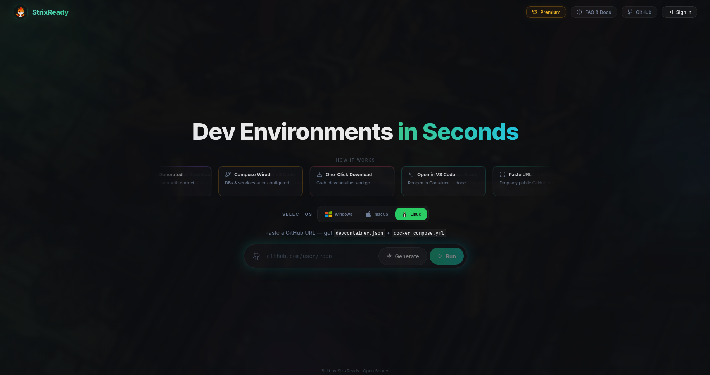

<div align="center">


<br/>

<!-- Live repo stats -->


<br/>

<!-- Tech stack -->
[](https://react.dev/)
[](https://typescriptlang.org/)
[](https://vitejs.dev/)
[](https://tailwindcss.com/)
[](https://ui.shadcn.com/)
[](https://fastapi.tiangolo.com/)
[](https://www.python.org/)

<br/>

**[🚀 Quick Start](#-quick-start) · [⚙️ How It Works](#%EF%B8%8F-how-it-works) · [🖥️ CLI](#%EF%B8%8F-cli) · [🔌 API](#-api-reference) · [💻 Tech Stack](#-tech-stack) · [🔮 Roadmap](#-roadmap)**

</div>

---

## 📖 Overview

**StrixReady** is an AI-powered developer toolchain that eliminates the friction of setting up local development environments.

The reality: cloning a repo and getting it to *actually run* often takes hours — writing Dockerfiles from scratch, hunting down missing env vars, wiring up databases, and wrestling with DevContainer configs. **StrixReady automates all of that.**

> 💡 Paste a GitHub URL. Pick your OS. Get a running dev server locally, or production-ready Docker config files — fully configured, zero manual setup.

This repository is a **monorepo** containing both the React frontend and the Python (FastAPI + Typer CLI) backend that powers it.

---

## 🎬 Gallery

<div align="center">
  
</div>

---

## ⚙️ How It Works

```
  GitHub URL + OS Selection
         │
         ▼
  ┌─────────────┐    POST /scan          ┌──────────────────────────────┐
  │  StrixReady │ ──────────────────▶    │   Backend API  :8000         │
  │   Frontend  │   GET /scan/stream      │                              │
  │    :8080    │ ◀────────────────────  │  1. Clone repository         │
  └─────────────┘   SSE live progress    │  2. Scan package.json /      │
                                          │     requirements.txt / README│
                                          │  3. Detect full stack (AI)   │
                                          │  4. Generate commands or     │
                                          │     Docker config files      │
                                          └──────────────┬───────────────┘
                                                         │
                                          ┌──────────────┴───────────────┐
                                          ▼                              ▼
                                 Local dev server                Dockerfile +
                                 on localhost                    docker-compose.yml
```

| # | Step | What happens |
|---|------|-------------|
| **01** | **Input** | Paste any public GitHub URL · Select host OS (Windows / macOS / Linux) |
| **02** | **Dispatch** | Frontend calls the backend API at `localhost:8000` |
| **03** | **Analysis** | Backend clones repo · scans manifests, lock files, CI configs |
| **04** | **Generation** | AI (Groq) returns install/dev commands, or full Docker config |
| **05** | **Ready** | Run instantly on localhost, or `docker compose up` |

---

## 🖥️ CLI

The same generation engine is also available as a terminal tool (`strix`), scriptable for CI/CD pipelines.

### Install

**Linux and macOS**

```sh
curl -fsSL https://raw.githubusercontent.com/sanjayrohith/StrixReady/main/scripts/install.sh | sh
```

**Windows (PowerShell)**

```powershell
irm https://raw.githubusercontent.com/sanjayrohith/StrixReady/main/scripts/install.ps1 | iex
```

Either script installs `strix` straight from GitHub — via [pipx](https://pipx.pypa.io/) when available (isolated, no dependency conflicts with other Python tools), falling back to `pip install --user` otherwise. Requires Python 3.10+.

> Prefer to build from source, or contributing? See [Quick Start](#-quick-start) below — `pip install -e .` from a clone works the same way.

### Usage

```bash
# Set your Groq API key (either works — the CLI checks both)
export GROQ_API_KEY=gsk_your_key_here
# or: mkdir -p ~/.strixready && echo "GROQ_API_KEY=gsk_your_key_here" > ~/.strixready/.env

# Run a repo locally
strix scan https://github.com/owner/repo

# Start the backend API (React frontend calls this)
strix gui

# Health-check running services
strix doctor
```

| Command | Description |
|---------|-------------|
| `strix scan <url>` | Clone, detect stack, install deps, run dev server locally |
| `strix scan <url> --os macos` | Specify target OS |
| `strix gui` | Start the backend API (port 8000) for the React frontend |
| `strix doctor` | Health-check running services |

---

## 🔌 API Reference

| Method | Endpoint | Description |
|--------|----------|-------------|
| `GET` | `/health` | Health check |
| `GET` | `/scan/stream/generate` | **Generate** — Clone + analyse + AI generates Docker config files, with SSE live progress |
| `POST` | `/scan` | Same as above, but blocking — single response once everything is done |
| `GET` | `/scan/stream` | **Run** — Clone + analyse + execute locally with SSE live progress |
| `POST` | `/scan/analyze` | Clone + analyse only (preview commands, no execution) |
| `POST` | `/run` | Execute commands in a given local directory |

<details>
<summary><strong>GET /scan/stream/generate</strong> — Docker file generation with live progress (Generate button)</summary>

SSE stream — each event is a JSON object:

```
GET /scan/stream/generate?url=https://github.com/owner/repo&os=linux
```

**Events:**
```
data: {"step": "clone",   "message": "Cloning repository...",              "data": null}
data: {"step": "analyze", "message": "Analysis complete",                  "data": {...}}
data: {"step": "ai",      "message": "AI returned Docker config...",       "data": {...}}
data: {"step": "write",   "message": "  wrote /tmp/.../Dockerfile",        "data": null}
data: {"step": "done",    "message": "Config files generated successfully!", "data": {"profile": {...}, "artifacts": {...}, "written_files": [...], "local_path": "..."}}
data: {"step": "end",     "message": "Stream complete",                    "data": null}
```

Steps: `clone` → `analyze` → `ai` → `write` → `done` → `end`. The `done` event's `data` is the same shape `POST /scan` returns in its response body.
</details>

<details>
<summary><strong>POST /scan</strong> — Docker file generation, blocking (no live progress)</summary>

**Request:**
```json
{ "url": "https://github.com/owner/repo", "os": "linux" }
```

**Response:**
```json
{
  "profile": {
    "name": "repo",
    "languages": ["TypeScript", "JavaScript"],
    "frameworks": ["Vite", "React"],
    "local_path": "/tmp/strix_.../repo"
  },
  "artifacts": {
    "Dockerfile": "FROM node:20-alpine\n...",
    "docker-compose.yml": "services:\n  repo:\n...",
    ".dockerignore": "node_modules\n.git\n...",
    ".env.example": "# API keys\nVITE_API_URL=...",
    "notes": "Single-stage Vite build. Run: docker compose up"
  },
  "written_files": [
    "/tmp/strix_.../repo/Dockerfile",
    "/tmp/strix_.../repo/docker-compose.yml",
    "/tmp/strix_.../repo/.dockerignore",
    "/tmp/strix_.../repo/.env.example"
  ],
  "local_path": "/tmp/strix_.../repo"
}
```
</details>

<details>
<summary><strong>GET /scan/stream</strong> — Local dev server with live progress (Run button)</summary>

SSE stream — each event is a JSON object:

```
GET /scan/stream?url=https://github.com/owner/repo&os=linux
```

**Events:**
```
data: {"step": "clone",       "message": "Cloning repository...",           "data": null}
data: {"step": "analyze",     "message": "Analysis complete",               "data": {...}}
data: {"step": "ai",          "message": "AI returned commands",            "data": {...}}
data: {"step": "commands",    "message": "Setup plan ready",                "data": {"install_command": "npm i", "dev_command": "npm run dev", ...}}
data: {"step": "install",     "message": "Installing dependencies: npm i",  "data": null}
data: {"step": "install",     "message": "Dependencies installed.",         "data": null}
data: {"step": "dev",         "message": "Starting dev server: npm run dev","data": null}
data: {"step": "done",        "message": "App running at http://localhost:8081", "data": {"running": true, "port": 8081, "pid": 12345}}
data: {"step": "end",         "message": "Stream complete",                 "data": null}
```

Steps: `clone` → `analyze` → `ai` → `commands` → `pre_install` → `install` → `post_install` → `dev` → `done` → `end`
</details>

<details>
<summary><strong>POST /scan/analyze</strong> — Preview only (no execution)</summary>

**Request:**
```json
{ "url": "https://github.com/owner/repo", "os": "linux" }
```

**Response:**
```json
{
  "profile": { "name": "repo", "languages": ["Python"], "frameworks": ["FastAPI"] },
  "commands": {
    "install_command": "pip install -r requirements.txt",
    "dev_command": "uvicorn main:app --reload",
    "port": 8000,
    "env_vars": { "DATABASE_URL": "" },
    "env_notes": "Set DATABASE_URL to your Postgres connection string."
  }
}
```
</details>

<details>
<summary><strong>POST /run</strong> — Execute commands in a local directory</summary>

**Request:**
```json
{
  "local_path": "/tmp/strix_.../repo",
  "commands": {
    "install_command": "npm install",
    "dev_command": "npm run dev",
    "port": 5173
  }
}
```

**Response:**
```json
{ "result": { "running": true, "port": 5173, "pid": 12345, "error": null } }
```
</details>

---

## 💻 Tech Stack

| Layer | Technology | Purpose |
|-------|-----------|---------|
| Frontend framework | [React 18](https://react.dev/) + [Vite](https://vitejs.dev/) | UI rendering & fast builds |
| Language (frontend) | [TypeScript](https://www.typescriptlang.org/) | Type-safe development |
| Styling | [Tailwind CSS](https://tailwindcss.com/) | Utility-first styling |
| Components | [shadcn/ui](https://ui.shadcn.com/) + [Radix UI](https://www.radix-ui.com/) | Accessible, composable UI |
| Icons | [Lucide React](https://lucide.dev/) | Consistent icon set |
| Routing | React Router DOM | Client-side navigation |
| State & Fetching | React Query + Fetch API | Server state management |
| Backend framework | [FastAPI](https://fastapi.tiangolo.com/) + [Uvicorn](https://www.uvicorn.org/) | REST + SSE API server |
| CLI | [Typer](https://typer.tiangolo.com/) + [Rich](https://rich.readthedocs.io/) | Terminal interface |
| AI | [Groq](https://console.groq.com/) | Stack detection & command/Docker generation |
| Language (backend) | Python 3.10+ | Analysis engine & API |

---

## 🚀 Quick Start

### Prerequisites

- **Node.js** 18+ and **npm**
- **Python** 3.10+
- **Git**
- A [Groq API key](https://console.groq.com) (free)

### 1. Clone the repository

```sh
git clone https://github.com/sanjayrohith/StrixReady.git
cd StrixReady
```

### 2. Start the backend API

```sh
pip install -e .
cp .env.example .env   # then fill in your GROQ_API_KEY
strix gui
# → http://localhost:8000
```

### 3. Start the frontend

```sh
cd frontend
npm install
npm run dev
# → http://localhost:8080 (or 8081 if occupied)
```

### Production Build (frontend)

```sh
cd frontend
npm run build
npm run preview
```

---

## 📁 Project Structure

```
StrixReady/
├── frontend/                    ← React + Vite + TypeScript UI
│   ├── public/                   # Static assets (favicon, screenshot, ...)
│   ├── src/
│   │   ├── components/           # Reusable UI components (shadcn/ui) + app components
│   │   ├── pages/                # Route-level page components
│   │   ├── hooks/                # Custom React hooks
│   │   ├── lib/                  # Utility functions & backend API client
│   │   ├── test/                 # Vitest setup + example test
│   │   └── main.tsx              # Application entry point
│   ├── index.html
│   ├── package.json
│   ├── package-lock.json         # npm is the package manager for this app
│   ├── components.json           # shadcn/ui config
│   ├── tailwind.config.ts
│   ├── postcss.config.js
│   ├── eslint.config.js
│   ├── tsconfig.json / tsconfig.app.json / tsconfig.node.json
│   ├── vite.config.ts
│   └── vitest.config.ts
├── backend/                     ← FastAPI app (port 8000)
│   ├── main.py                    # API routes (scan, scan/stream, run, health)
│   ├── analyzer.py                # Clone repo + detect stack (with on_log callbacks)
│   ├── generator.py               # AI command/Docker generation + local execution
│   ├── commands.py                # Deterministic fallback command inference
│   ├── health.py                  # Health checks
│   ├── utils.py                   # Shared colour constants
│   └── prompts/                   # System prompts, shipped as package data
│       ├── analyze_repo_prompt.txt        # System prompt used while analysing a repo
│       ├── generate_artifacts_prompt.txt  # System prompt for local dev commands (Run)
│       └── generate_docker_prompt.txt     # System prompt for Docker file generation (Generate)
├── cli/
│   └── main.py                    # Typer CLI (scan, gui, doctor)
├── scripts/
│   ├── install.sh                 # One-line installer for Linux/macOS
│   └── install.ps1                # One-line installer for Windows
├── test.py                      ← Manual script to test AI generation against a repo URL
├── pyproject.toml               ← `strix` CLI package definition (installs cli/ + backend/)
├── requirements.txt              # Pinned backend dependencies
├── .env.example                  # Template for GROQ_API_KEY
├── .env                          ← your local GROQ_API_KEY (not committed)
└── LICENSE
```

---

## 🔮 Roadmap

- [x] **Real-time Progress Streaming** — Both the Run and Generate buttons stream live progress from the backend via SSE (`/scan/stream` and `/scan/stream/generate`) instead of a static spinner.
- [ ] **Interactive Config Editor** — Preview and tweak generated `devcontainer.json` and `docker-compose.yml` (ports, extensions, env vars) directly in the browser before downloading.
- [ ] **Environment History** — Persist recently generated environments locally for quick re-access and comparison.
- [ ] **Dark / Light Mode Toggle** — Accessible light mode alongside the current dark glassmorphism theme.
- [ ] **Direct "Open in VS Code"** — Deep linking via `vscode://` to auto-launch the editor and trigger the container build with zero manual file placement.
- [ ] **Monorepo Multi-service Detection** — Smarter analysis of monorepo structures with automatic service isolation in the generated compose file.

---

## License

MIT
